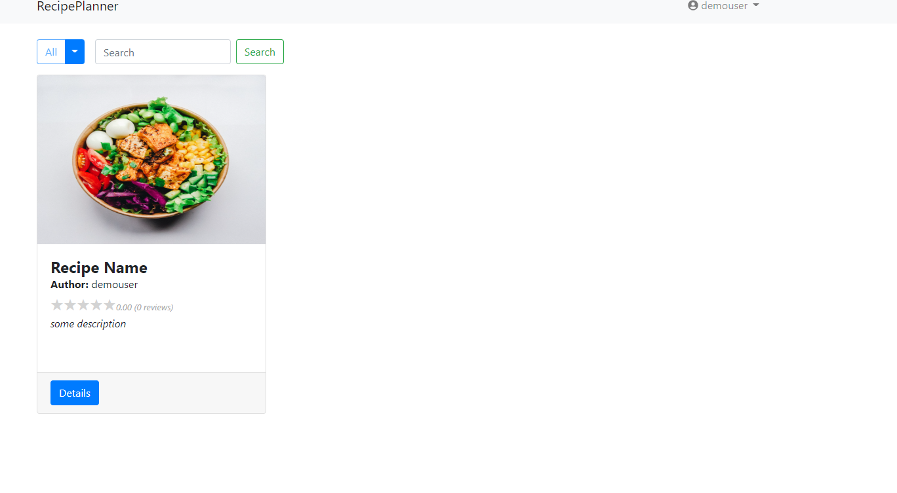
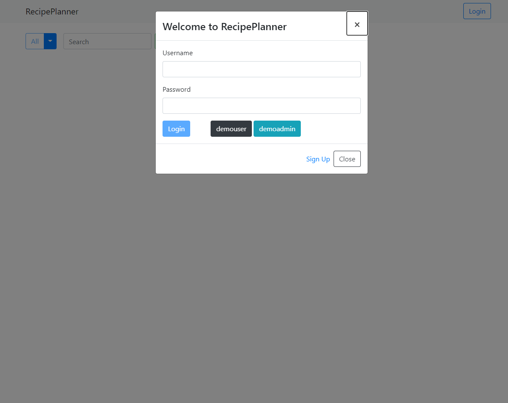
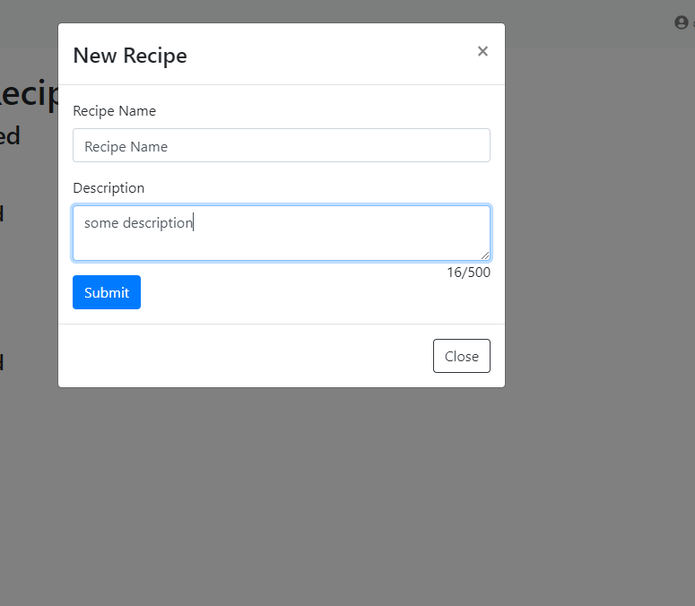
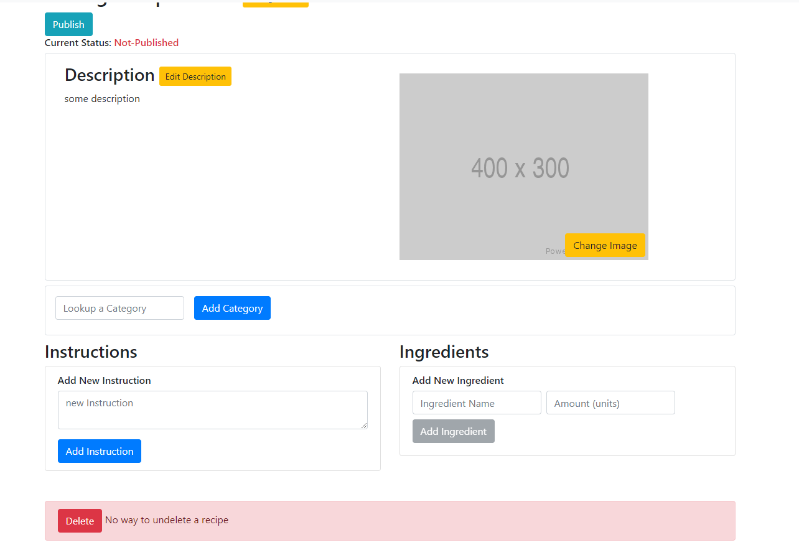
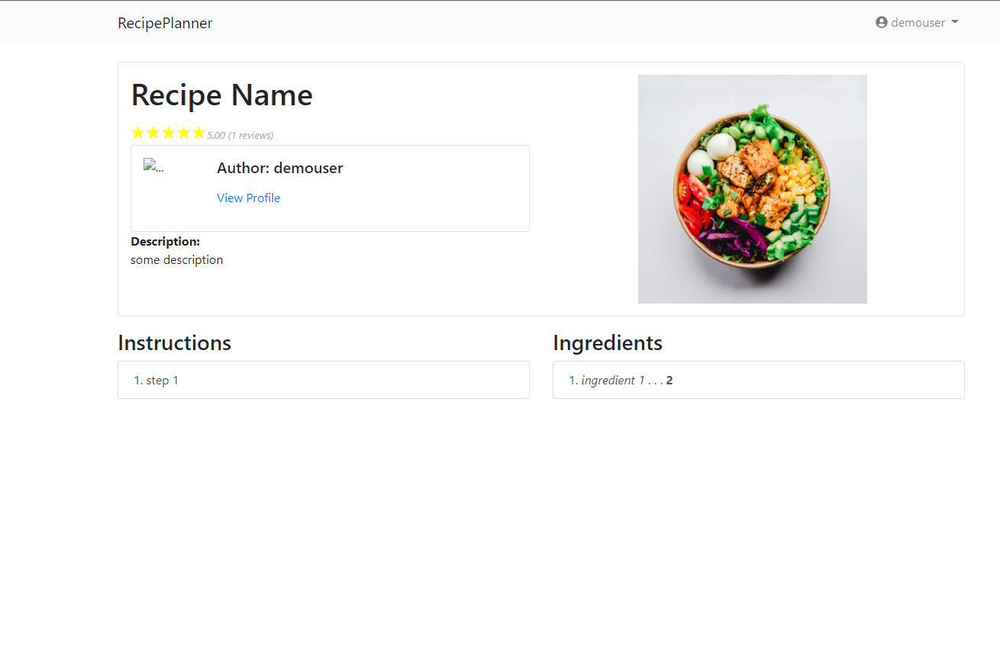
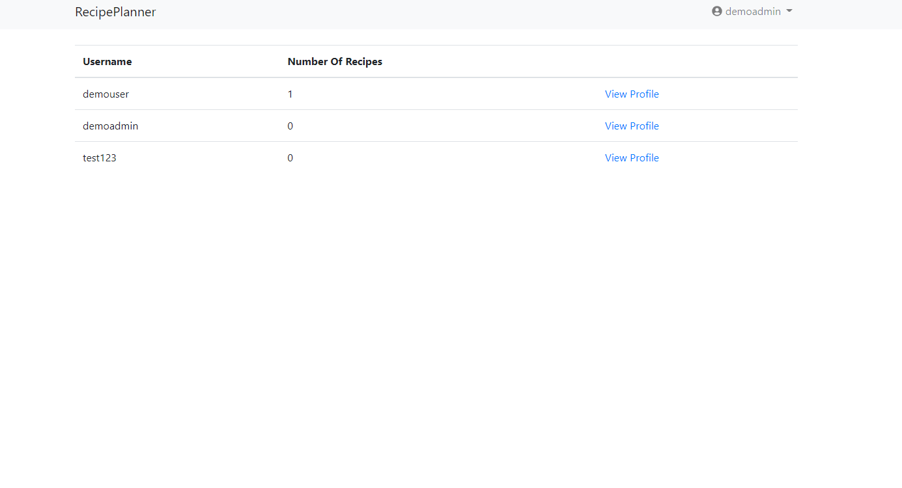

# RecipePlanner

~~Deployed Site: [http://recipe-planner-frontend.s3-website-us-east-1.amazonaws.com](http://recipe-planner-frontend.s3-website-us-east-1.amazonaws.com)~~

AWS Account Free Trial expired, site is no longer deployed to AWS Elastic Bean Stalk. Recorded Screenshots in the [Features](#Features) section below

Backend Code: [https://github.com/KevinW831205/RecipePlannerBackend](https://github.com/KevinW831205/RecipePlannerBackend)

## Summary 

A recipe sharing website that allows users to create and publish recipes for other users to view and rate.

To be implemented: feature that allow users to plan recipes to make and generate a shopping list.

# Features

1. Viewing recipes created by other users.

2. Creating an account, Demo accounts availalble

3. Creating a recipe with an account

4. Viewing a recipe details and rating

5. Admin view

# Technologies and Framework

This project was generated with [Angular CLI](https://github.com/angular/angular-cli) version 8.3.19.

Angular Bootstrap

Angular Font Awesome

Angular 2 Validation
